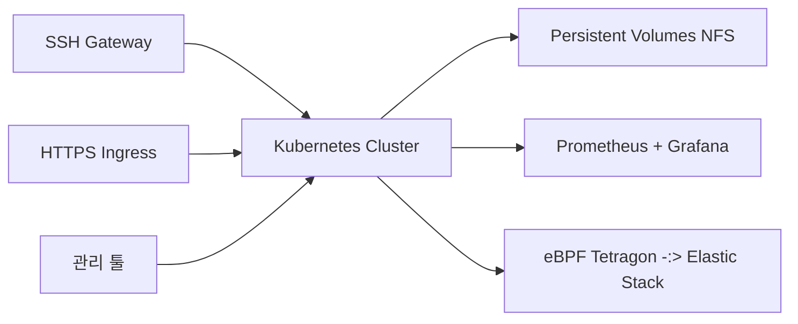

# Enhancing Observability in Cloud Based Educational Linux Lab Environment - Isu Kim

다중 선택: OSS 2023 JN

## 1. 발표자 & 배경

- **발표자**: 김이석, 단국대학교 모바일 OS 연구실 학부생
- **연구 분야**: 클라우드 관측성(observability), 시스템 모니터링, 분산 트레이싱
- **실험실 환경**: 기존 Android OS → 최신에는 클라우드 기반 Linux 실습 환경 연구

## 2. 동기 & 요구사항

1. **기존 실습 환경의 문제**
    - Raspberry Pi
        - 👍 물리 머신 직접 제공 → 설치·HW 실습 자유
        - 👎 기기·액세서리 가격 급등 / 장비 관리 부담
    - 학생 PC 위 가상머신(VM)
        - 👍 무상 제공, 스냅샷 복구 용이
        - 👎 일부 학생 PC 사양 미충족 → 형평성 문제
    - 퍼블릭 클라우드 인스턴스
        - 👍 대규모 VM 관리·공용 IP 제공
        - 👎 장기 비용 부담, 자산 불보유
2. **우리만의 클라우드 설계 시 추가 요구**
    - **격리된 Linux VM**: 400+명의 학생이 소수 HW 자원 공유
    - **간단한 관리 UI/툴**: 대량 계정·VM 일괄 생성·삭제
    - **제한된 진입점**: SSH 게이트웨이·HTTPS Ingress + 방화벽 정책
    - **강화된 관측성**:
        1. 클러스터·컨테이너 레벨 실시간 자원 모니터링
        2. 각 VM 내부 사용자 활동 / 시스템 콜 상세 추적
        3. 관측 오버헤드 최소화

## 3. 인프라 구조

- **SSH Gateway & HTTPS Ingress**: 학생별 계정 기반 단일 진입점
- **K8s + PVC**: VM(DevContainer / Jupyter) Pod로 서비스
- **관리 툴**: K8s API 활용한 계정·리소스 프로비저닝 자동화
- **2단계 관측성**
    1. Prometheus / Grafana → 실시간 CPU·메모리·I/O 수집·시각화
    2. eBPF(Tetragon) + Elastic Stack → 시스템 콜·네트워크 이벤트·SSH 로그 세부 수집

## 4. 핵심 구현

1. **리소스 모니터링** (Prom / Grafana)
    - Kubelet → cAdvisor 메트릭 → Prom pull
    - Namespace·Pod 단위 실시간 대시보드
    - 알람 룰: CPU / 메모리 / I/O 과다 사용 감지
2. **세부 활동 추적** (eBPF → Tetragon → ELK)
    - eBPF로 커널 런타임 시스템콜 훅
    - Tetragon: Pod 컨텍스트 부착, JSON 이벤트 생성
    - Logstash → Elasticsearch → Kibana 시각화
    - 사례
        - SSH 로그인 실패 탐지
        - 파일 I/O (NFS 쓰기) 트레이스
        - 프로세스 폭주(fork bomb) 시스템콜 기록

## 5. 데모 요약

- **SSH 접속·비밀번호 강제 변경**
- **DevContainer & JupyterLab 서비스**
- **eBPF 이벤트 실시간 수집**
    - `connect()` / `open()` syscall
    - NFS I/O write
    - SSH auth failure

## 6. 남은 과제 & 향후 연구

- **스토리지 병목**: NFS HDD → I/O 성능 저하 및 네트워크 부하
- **컨테이너 권한 한계**: `sysctl`, capabilites 제약 → VM 기반 K8s 확장(필요)
- **중복 소스 관리**: 대형 Android 루트 코드 중복 저장 → 스토리지 최적화
- **사용자 공간 모니터링**: eBPF 한계 → VM 내 추가 에이전트 검토
- **실시간 보안 강화**: LSM·eBPF 기반 자동 대응(Anomaly Detection, IOC 차단)
- **분산 트레이싱**: 컨테이너 간 causality 추적 프레임워크 연구

> 핵심: 제한된 자원·안정성 요구 속에
> 
> - Kubernetes 기반 VM 실습 환경 구축
> - 2단계 관측성(메트릭 + eBPF 로그)으로 문제 탐지
> - 지속적 퍼포먼스 최적화 & 보안 강화 연구 중